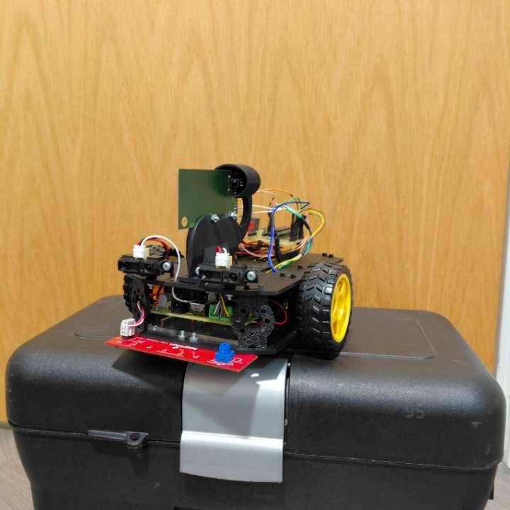
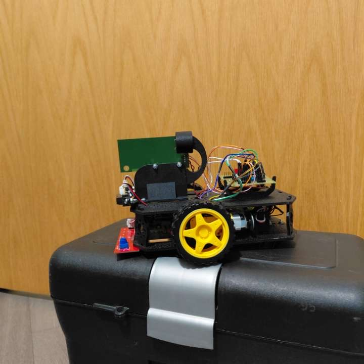

# Autonomous Line Following Robot using Embedded C and PIC Microcontroller

## Overview

This project involved designing and programming an autonomous line-following robot using embedded C on a PIC microcontroller.

The robot follows a white line on a black track using an IR sensor array and feedback-based motor control. Advanced behaviours were also implemented, including perpendicular line detection, lane transitions, encoder-assisted turning, and automatic obstacle braking.

This project demonstrates embedded systems programming, robotics control, sensor integration, actuator control, and iterative engineering debugging.

---

## Features

- White line tracking on black surface
- PD-based line following control
- IR sensor array integration
- Line loss recovery
- Perpendicular line detection
- Lane transitions
- Encoder-assisted 180° turning
- Automatic obstacle braking
- Final stop sequence

---

## Hardware Used

- PIC microcontroller
- PICkit 3 programmer
- IR line sensor array
- DC motors
- Motor driver
- Wheel encoder
- Distance sensor
- Robot chassis
- Battery supply

---

## Software Stack

- Embedded C
- MPLAB X IDE
- XC8 Compiler

---

## How It Works

The robot continuously reads line sensor data to determine its position relative to the track.

A PD-style control strategy adjusts motor speeds using PWM to keep the robot centred on the line.

Additional logic handles:
- recovering when the line is lost
- detecting perpendicular markers
- changing lanes
- performing an encoder-based turn
- braking when obstacles are detected

---

## How to Reproduce

This is embedded firmware for physical hardware and cannot be run as a normal desktop C program.

To reproduce:

1. Open the source code in MPLAB X IDE
2. Select the correct PIC microcontroller
3. Build using the XC8 compiler
4. Connect the PICkit 3 programmer
5. Flash the firmware to the microcontroller
6. Connect robot hardware
7. Test on the physical track

---

## Media

### Robot Photos

### Demonstration Videos

Robot line-following demo:

[Watch line-following demo](./Img%205269(1).mp4)

Automatic braking demo:

[Watch automatic braking demo](./Img%205270.mp4)
## Engineering Challenges

Challenges encountered included:

- tuning control for smooth curves
- recovering after line loss
- reliable lane transitions
- encoder calibration
- sensor interpretation issues
- balancing aggressive correction with stability

These were solved through iterative debugging and testing.

---

## Future Improvements

- full PID optimisation
- adaptive speed control
- smoother lane transitions
- smarter obstacle classification
- wireless telemetry
- path memory
